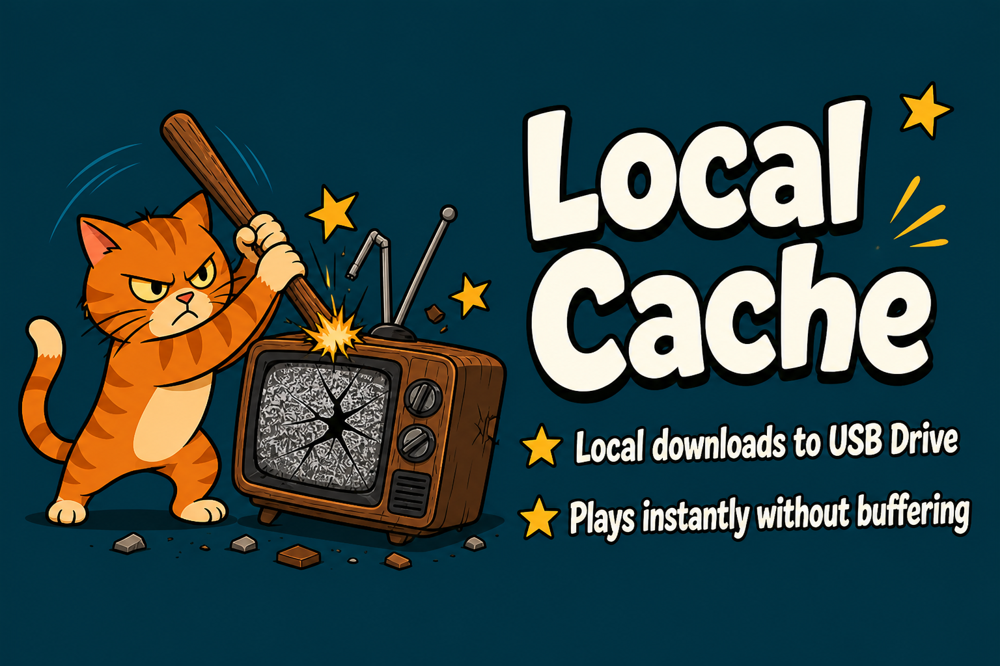

# Local Cache 🍿💾



**Watch now. Save it locally. Watch without buffering.**

Local Cache is a tiny Android TV app that runs a Stremio add-on *on your TV*.  
You pick a stream like usual (Torrentio / Comet) — **debrid or torrent, both work**. Debrid is faster. **You can start watching while it downloads** — no waiting for the whole file. While you chill, it copies the movie to a USB stick (recommended) or internal storage and plays from it.

### ✨ The big win

**No more buffering mid-movie.**  
Once the file is local, your TV isn’t fighting your internet anymore. Smooth playback. That’s the whole point.

**Latest APK:** [v0.5.8](https://github.com/heroiamarelo1/Local-Cache/releases/tag/v0.5.8)

---

## Debrid and torrents

Both work. Paste your Torrentio / Comet manifests in `/settings`, check the debrid services you use, and turn on **Torrents** if you want magnets. Debrid (AllDebrid, TorBox, Real-Debrid, …) starts sooner; torrents are fine, just slower.

---

## What you get 🧰

- 📺 Stremio add-on living on the TV (`http://127.0.0.1:7100/manifest.json`) and the APK that runs the local server
- ▶️ **Play while downloading** — don’t wait for 100%
- 💾 **USB recommended**, or **internal storage** fallback (quality compromises — TV storage is limited)
- 🧠 Smart picks — prefers cached debrid links, 1080p or 4K+sound mode; on internal storage, prefers a stream that **fits free space**
- 🧲 **Debrid and torrent downloads** — both work; debrid is faster
- 🔗 Multiple Torrentio / Comet URLs (Torrentio = one debrid per link → add two for AD + TorBox)
- 📱 Setup from your phone on the same Wi‑Fi — `/settings` for manifests, debrid filters, storage, resume/cancel downloads
- 📊 Live download / playback status in the app and on `/settings`

---

## What you need 📦

- Android TV / Google TV
- [Stremio](https://www.stremio.com/) (or something compatible)
- A USB drive formatted **exFAT** (recommended) — or enough free internal space (app suggests ~80% of free space; needs ≥2 GB free for internal mode)
- Torrentio / Comet manifests (debrid and/or torrents — turn torrents on in `/settings`)

---

## How it works? 🚀

1. 📦 **Sideload the app** on your Android TV / Google TV ([Releases](https://github.com/heroiamarelo1/Local-Cache/releases))
2. ▶️ **Start the server** in Local Cache — pick USB, or use internal storage if you must
3. 📱 **Configure on your phone** — same Wi‑Fi, open `TV_IP:7100/settings` (it’s written in the app), paste Torrentio / Comet manifests, check your debrid services, turn on **Torrents** if you want magnets
4. 🎬 **Add the add-on in Stremio** → `http://127.0.0.1:7100/manifest.json`
5. 🍿 **Pick a stream** — watch while it saves locally

---

## Build it yourself 🛠️

```bash
cd android
./gradlew :app:assembleDebug
```

Release APK: `./gradlew :app:assembleStandardRelease` — package `app.localcache.release` (port **7100**).

- **Stremio on the TV:** install `http://127.0.0.1:7100/manifest.json`
- **WuPlay (local add-on):** use the TV’s LAN IP, e.g. `http://192.168.x.x:7100/manifest.json` (same Wi‑Fi; no separate WuPlay APK)

---

## Config cheat sheet ⚙️

Easiest path: phone → `/settings`.  
Or read `android/app/src/main/assets/local-cache-config.README.txt`.

| Field | What it’s for |
|--------|----------------|
| `torrentioManifestUrls` | Your Torrentio manifest(s) |
| `cometManifestUrls` | Optional public / ElfHosted Comet |
| `localCometManifestUrls` | Optional Comet on your LAN |
| `streamQuality` | `1080p` or `4k_sound` |
| `resultMode` | `fastest` (default; debrid hit or fall back to fast), `fast`, or `complete` |
| `debridServices` | Only the debrids you actually use |

---

## License

[MIT](LICENSE) — do whatever you want with it. 🆓

## Disclaimer

Not affiliated with Stremio, Torrentio, Comet, or any debrid. Use your own keys, follow their rules.
